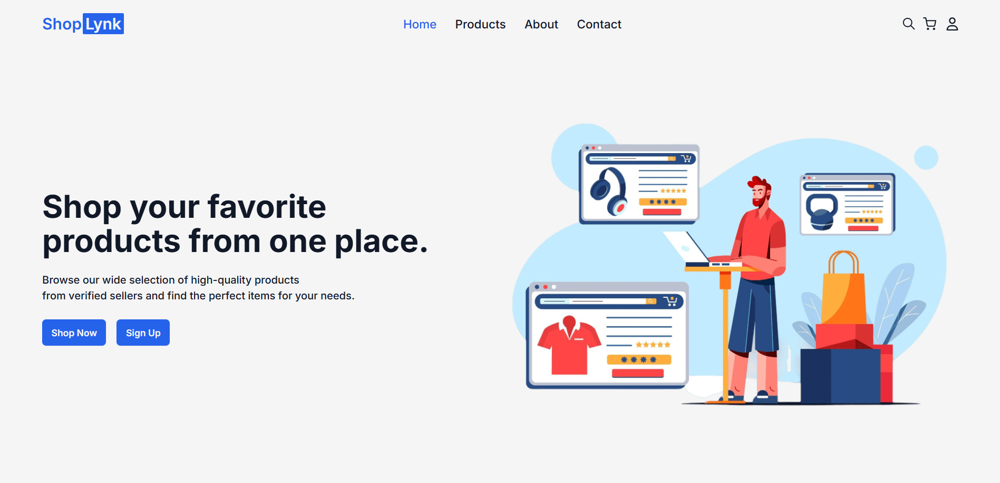

# ShopLynk – Multi vendor E-commerce Platform

ShopLynk is a full-featured, modern e-commerce platform designed for seamless online shopping experiences. Built with a robust React frontend and a scalable Node.js/Express backend, ShopLynk supports both buyers and sellers with a rich set of features, intuitive UI and secure payment integration.

## Features

- 🛒 **User-Friendly Shopping**: Browse, search, and filter products with ease.
- 👤 **User & Seller Authentication**: Secure registration, login, and role-based access.
- 🛍️ **Product Management**: Sellers can add, update, and manage their products.
- 🛒 **Cart & Orders**: Add to cart, place orders, and track order status.
- 💳 **Secure Payments**: Integrated payment gateway for safe transactions.
- ⭐ **Product Reviews**: Leave and read reviews for products.
- 📦 **Order Management**: View order history, order details, and order status updates.
- 📈 **Seller Dashboard**: Sellers can view and manage their orders and products.
- 📧 **Email Notifications**: Automated emails for order confirmations and updates.
- 🔒 **Protected Routes**: Role-based route protection for users and sellers.
- 🎨 **Modern UI**: Responsive, mobile-friendly design with Tailwind CSS.

## Tech Stack

- **Frontend**: React, Vite, Redux, Tailwind CSS
- **Backend**: Node.js, Express.js, MongoDB
- **Authentication**: JWT, bcrypt
- **Payments**: Integrated payment gateway with Stripe
- **Cloud Storage**: Cloudinary for product images
- **Deployment**: Vercel (Frontend), Render (Backend)

## Screenshot

## Live Demo

[View Live Demo](https://shoplynk.vercel.app/)
